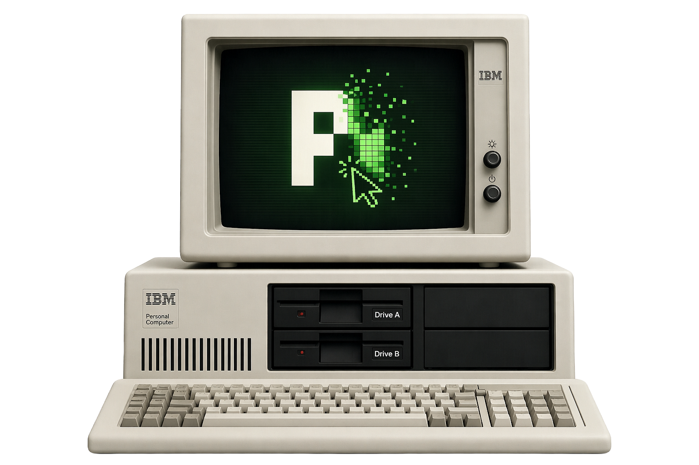

# pi-computer-use

<p align="center">
  
</p>

`pi-computer-use` lets AI agents use macOS apps.

An agent can look at an app window, understand the buttons and text inside it, and perform actions like clicking, typing, scrolling, and waiting for something to change. This is useful when the agent needs to work with a normal desktop app instead of an API, a terminal command, or a file.

New to computer use? Start with: [Wait, what exactly is Computer Use?](http://localhost:4173/what-exactly-is-computer-use/)

## What this package does

This is a Pi extension. After installation, Pi agents get tools for:

- finding open apps and windows
- observing what is visible in a window
- searching the visible interface for text, buttons, and controls
- inspecting parts of the interface in more detail
- clicking, typing, scrolling, and pressing UI controls
- waiting for UI changes

In short: it gives an agent a controlled way to operate desktop software.

## What this package is not

`pi-computer-use` is not a replacement for app APIs or MCP servers. If an app has a reliable direct integration, use that first.

Computer use is most helpful when the only available interface is the app on screen.

## Install

```bash
pi install git:github.com/injaneity/pi-computer-use@main
```

Start Pi and grant permissions to:

```text
/Applications/pi-computer-use.app
```

Required macOS permissions:

- Accessibility
- Screen Recording, shown as Screen and System Audio Recording on newer macOS versions

The setup flow registers the helper first, so it should already appear in both Settings panes. Enable the toggles and choose Recheck.

Use `/computer-use` inside Pi to show the active configuration and where it came from.

## Main tools

- `list_apps`
- `list_windows`
- `observe`
- `search_ui`
- `expand_ui`
- `inspect_ui`
- `act`
- `read_text`
- `wait_for`

See [docs/usage.md](./docs/usage.md) for the full tool reference.

## Documentation

- [Usage](./docs/usage.md)
- [Architecture](./docs/architecture.md)
- [Configuration](./docs/configuration.md)
- [Development](./docs/development.md)
- [Troubleshooting](./docs/troubleshooting.md)
- [Contributing](./CONTRIBUTING.md)

## Development status

The current architecture is centered on `observe` and `act`: first inspect the current UI state, then ask the helper to perform one grounded action transaction. Older direct tools such as `screenshot`, `click`, `set_text`, and `computer_actions` are no longer part of the public extension surface.

Behavioral benchmarking should use `node scripts/cubench.mjs` against the registered extension tools.

## License

MIT
