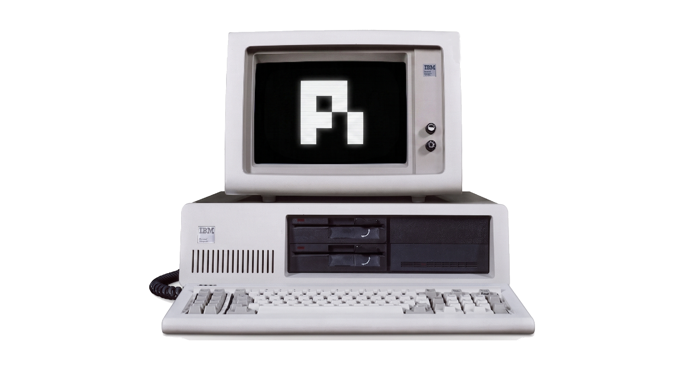
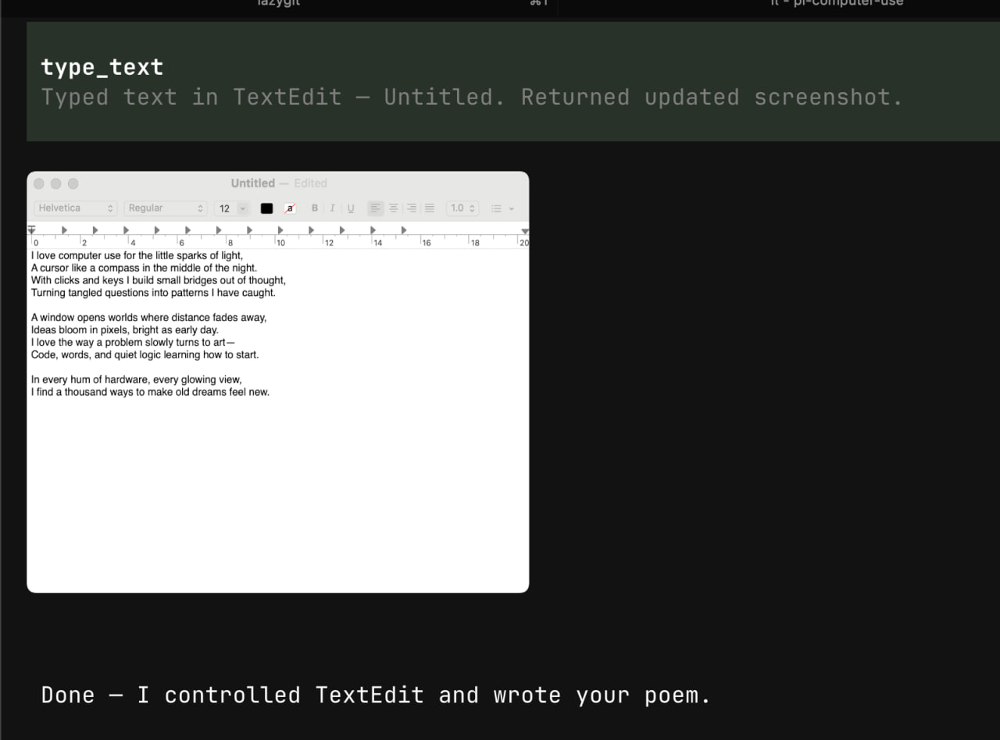

# pi-computer-use

<div align="center">
    
</div>

Codex-style computer use for [Pi](https://pi.dev/) on macOS.

`pi-computer-use` gives Pi agents a small, semantic computer-use surface for visible macOS windows. It prefers Accessibility (AX) targets such as `@e1` for background-safe interaction, returns semantic state after every action, and attaches screenshots only when the semantic state is too weak for reliable operation.

## Latest Release

See the [latest GitHub release](https://github.com/injaneity/pi-computer-use/releases/latest) for the current version, release name, value proposition, changelog, and validation snapshot.

Install:
- GitHub release: `pi install git:github.com/injaneity/pi-computer-use#v0.2.0`.
- npm package: `npm install @injaneity/pi-computer-use@0.2.0`.

If you are installing a different release, replace `v0.2.0` or `0.2.0` with the version you want to pin.

## Contents

- [What it provides](#what-it-provides)
- [Requirements](#requirements)
- [Install](#install)
- [First run setup](#first-run-setup)
- [Using the tools](#using-the-tools)
- [Configuration](#configuration)
- [Local development](#local-development)
- [Benchmarks](#benchmarks)
- [Troubleshooting](#troubleshooting)
- [Contributing](#contributing)
- [Remove](#remove)

## Screenshots



## What it provides

- Public tools: `screenshot`, `click`, `double_click`, `move_mouse`, `drag`, `scroll`, `keypress`, `type_text`, `set_text`, `wait`, `computer_actions`.
- AX target refs in tool results, e.g. `@e1`, with capabilities like `canSetValue`, `canPress`, and `canFocus`
- Ref-first actions such as `click({ ref: "@eN" })`, `scroll({ ref: "@eN" })`, and `set_text({ ref: "@eN", text })` before coordinate or focus fallbacks.
- Batched actions through `computer_actions`, with one post-action semantic state update plus per-action execution metadata.
- Execution metadata that reports the selected implementation variant: `stealth` for background-safe AX paths and `default` for focus/raw-event fallbacks.
- Full pointer and keyboard primitive coverage for common GUI flows, with AX-first equivalents where available.
- Semantic-first turn updates, with image attachment only when fallback context is needed.
- Stealth mode as the widest safe subset: AX/background-safe operations run, while foreground focus, raw keyboard/pointer events, and cursor takeover are blocked.
- Browser-aware targeting, including an isolated browser window preference when appropriate.
- User-visible config for browser control and stealth/strict AX execution.
- Non-intrusive helper behavior where possible instead of global cursor takeover.
- Official QA benchmark harness in `benchmarks/` with baseline comparison and regression checks.

## Requirements

- macOS. The native helper and window capture paths are macOS-only.
- Pi with extension support.
- Node.js `>=20.6.0` for local development and package scripts.
- One-time macOS permissions for the helper:
  - Accessibility, so the agent can inspect and interact with windows.
  - Screen Recording, so the agent can capture window screenshots when semantic state is not enough.

## Install

The package is published on npm as `@injaneity/pi-computer-use` and can also be installed directly by Pi from GitHub.

### Pi

```bash
pi install git:github.com/injaneity/pi-computer-use#v0.2.0
# project-local
pi install -l git:github.com/injaneity/pi-computer-use#v0.2.0
# local checkout
pi install /absolute/path/to/pi-computer-use
```

### npm

```bash
npm install @injaneity/pi-computer-use
# pinned version
npm install @injaneity/pi-computer-use@0.2.0
```

Use the GitHub release tag for `pi install`. Use npm when you want the package directly through the npm registry.

## First run setup

Start Pi in interactive mode. On session start, the extension checks whether computer-use is ready and guides you through setup if permissions are missing.

Grant both permissions to the helper at:

```text
~/.pi/agent/helpers/pi-computer-use/bridge
```

Required permissions:
- Accessibility
- Screen Recording

After granting permissions, return to Pi and retry the tool call or start a new session.

## Using the tools

Call `screenshot` first. It selects the controlled window and returns the latest semantic state.

When tool results include AX refs, prefer refs before coordinates:

```ts
click({ ref: "@e1" })
set_text({ ref: "@e2", text: "hello" })
scroll({ ref: "@e3", scrollY: 600 })
```

Use screenshot-relative coordinates only when there is no suitable AX target:

```ts
click({ x: 320, y: 180, captureId: "..." })
```

For text input:
- Use `set_text` when you want to replace a whole AX text value.
- Use `click` plus `type_text` when cursor position or insertion behavior matters.
- Use `keypress` for Enter, Escape, Tab, arrows, deletion, and shortcuts.

Use `computer_actions` when the next actions are obvious and do not require inspecting intermediate state:

```ts
computer_actions({
  captureId: "...",
  actions: [
    { type: "click", ref: "@e1" },
    { type: "set_text", ref: "@e2", text: "https://example.com" },
    { type: "keypress", keys: ["Enter"] }
  ]
})
```

Do not batch actions when a later step depends on seeing the result of an earlier step.

## Configuration

Optional JSON config files make browser control and stealth/strict AX mode visible and project-overridable:

```text
~/.pi/agent/extensions/pi-computer-use.json  # global
.pi/computer-use.json                        # project-local override
```

Example:

```json
{
  "browser_use": true,
  "stealth_mode": false
}
```

Defaults preserve existing behavior: browser use is enabled, and stealth mode is disabled. Set `browser_use` to `false` to refuse screenshots/actions against known browser apps. Set `stealth_mode` to `true` to require background-safe Accessibility paths and block foreground/raw pointer or keyboard fallbacks.

Environment overrides:

- `PI_COMPUTER_USE_BROWSER_USE=0|1`
- `PI_COMPUTER_USE_STEALTH_MODE=0|1`
- `PI_COMPUTER_USE_STEALTH=1` or `PI_COMPUTER_USE_STRICT_AX=1` force stealth mode on

Run `/computer-use` in Pi to show the effective config and config sources.

## Local development

If you want to work on a local checkout:

```bash
npm install
# optional: build the helper into the installed helper path
node scripts/build-native.mjs --output ~/.pi/agent/helpers/pi-computer-use/bridge
```

To run the checkout in Pi without loading another installed copy at the same time:

```bash
pi --no-extensions -e .
```

For benchmark and contribution workflow, see [CONTRIBUTING.md](./CONTRIBUTING.md) and `benchmarks/README.md`.

### Helper build

If you need to build the helper manually:

```bash
node scripts/build-native.mjs
# build both release prebuilts
node scripts/build-native.mjs --arch all
# or build directly to the installed helper path
node scripts/build-native.mjs --output ~/.pi/agent/helpers/pi-computer-use/bridge
```

Local helper builds are ad-hoc codesigned by default. For a release build with a stable Apple Developer identity, use a Developer ID Application certificate:

```bash
node scripts/build-native.mjs --arch all \
  --sign-identity "Developer ID Application: Your Team (TEAMID)" \
  --hardened-runtime \
  --timestamp
```

The helper is signed with the stable identifier `com.injaneity.pi-computer-use.bridge` by default. You can override it with `--sign-identifier` or `PI_COMPUTER_USE_CODESIGN_IDENTIFIER`, but release builds should keep it stable so macOS permissions remain tied to the same helper identity across updates.

Unsigned or ad-hoc signed helpers can work for local development, but macOS treats them as local binaries. Developer ID signing gives the helper a trusted publisher identity, enables notarization, reduces Gatekeeper/TCC friction, and makes permission prompts easier for users to trust. It does not remove the need for the user to grant Screen Recording and Accessibility.

## Benchmarks

The official benchmark harness lives in [`benchmarks/`](./benchmarks/README.md). It measures AX-only coverage, fallback rate, targeting success, primitive coverage, and latency.

Run the default contributor benchmark:

```bash
npm run benchmark:qa
```

Run the wider benchmark that may open apps:

```bash
npm run benchmark:qa:full
```

Use benchmark results when changing semantic targeting, fallback policy, AX behavior, browser handling, or native helper behavior.

## Troubleshooting

### The helper is missing or not executable

Reinstall the helper from the package:

```bash
node scripts/setup-helper.mjs --runtime
```

Or build it locally:

```bash
node scripts/build-native.mjs --output ~/.pi/agent/helpers/pi-computer-use/bridge
```

### macOS permissions still fail

Confirm that both Accessibility and Screen Recording are granted to:

```text
~/.pi/agent/helpers/pi-computer-use/bridge
```

If macOS still denies access, remove the helper from the permission list, add it again, and restart Pi.

### Browser windows are refused

Check the effective config:

```text
/computer-use
```

If `browser_use` is disabled, enable it in `~/.pi/agent/extensions/pi-computer-use.json` or `.pi/computer-use.json`.

### Strict AX mode blocks an action

Strict AX mode intentionally blocks raw pointer events, raw keyboard events, foreground focus fallbacks, and cursor takeover. Use AX refs from the latest `screenshot`, disable strict mode, or perform the unsupported step manually.

## Contributing

Read [CONTRIBUTING.md](./CONTRIBUTING.md) before opening a PR. In short:

1. Open an issue first.
2. Get alignment before starting larger changes.
3. Run the relevant benchmark before and after behavior changes.
4. Include the AI transcript if AI tools helped produce the PR.

## Remove

```bash
pi remove git:github.com/injaneity/pi-computer-use#v0.2.0
# or remove the npm package from a JS project
npm remove @injaneity/pi-computer-use
```
